 
  

<!-- &不能居中

-->

 
  Visitor count 
  

 

  

<!--  -->

<!--START_SECTION:waka-->
<table border="1" cellspacing="0" cellpadding="20" align="center" style="border:1px solid #ccc;"><tbody><tr align="center"><td colspan=7>Total coding time in the last 7 days : 37 hrs 37 mins</td></tr><tr><td>6月28号   星期六</td><td>6月29号   星期日</td><td>6月30号   星期一</td><td>7月1号   星期二</td><td>7月2号   星期三</td><td>7月3号   星期四</td><td>7月4号   星期五</td></tr><tr><td>36 mins</td><td>44 mins</td><td>8 hrs 20 mins</td><td>41 mins</td><td>7 hrs 6 mins</td><td>10 hrs 28 mins</td><td>9 hrs 39 mins</td></tr></tbody></table>
<!--END_SECTION:waka-->

**Languages**

<!-- <code>Java</code> -->

**Tools**

### my emoji

😋😛😜🤪😝

<!-- 

-->

_generated with [Platane/snk](https://github.com/Platane/snk)_

<!-- 

 -->

<!-- 
### Hi there 👋
 -->

<!--
**shuxuecode/shuxuecode** is a ✨ _special_ ✨ repository because its `README.md` (this file) appears on your GitHub profile.

Here are some ideas to get you started:

- 🔭 I’m currently working on ...
- 🌱 I’m currently learning ...
- 👯 I’m looking to collaborate on ...
- 🤔 I’m looking for help with ...
- 💬 Ask me about ...
- 📫 How to reach me: ...
- 😄 Pronouns: ...
- ⚡ Fun fact: ...
-->
